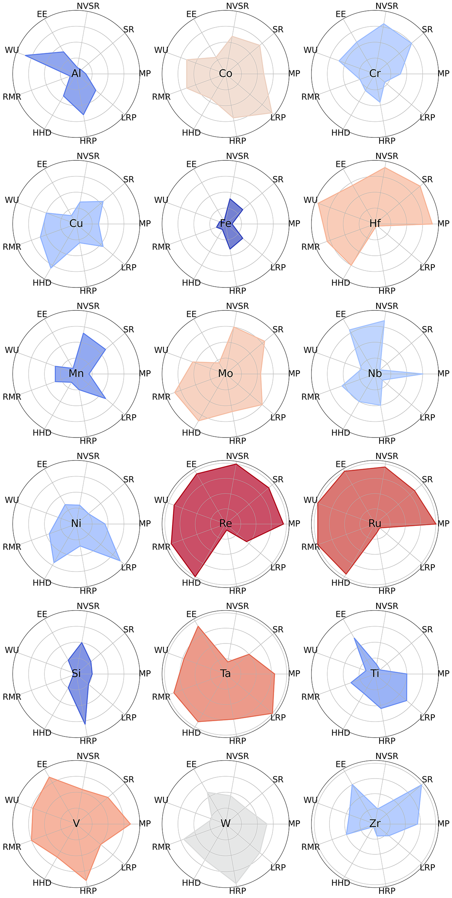
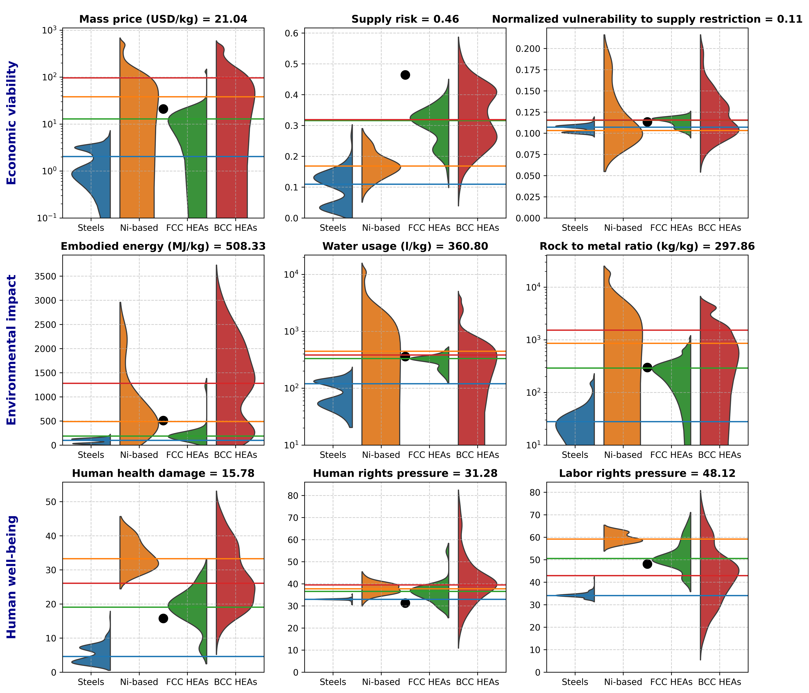

# Element Indicators Dataset

## Overview
This dataset contains 9 sustainability indicators for 18 elements commonly used in High Entropy Alloys (HEAs).

## Elements
The dataset covers the following elements:
Al, Co, Cr, Cu, Fe, Hf, Mn, Mo, Nb, Ni, Re, Ru, Si, Ta, Ti, V, W, Zr.

## Indicators
| Indicator Name         | Description                                                                 | Unit        |
|------------------------|-----------------------------------------------------------------------------|------------|
| Raw material price     | The market price of the element in its pure form.                          | USD/kg     |
| Supply risk            | Probability of supply disruptions due to geopolitical or natural factors.   | Probability (0-1) |
| Normalized vulnerability to supply restriction | Scarcity metric adjusted for global availability. | Probability (0-1)   |
| Embodied energy        | The energy required for primary production of the element.                 | MJ/kg      |
| Water usage            | The water consumed in the production of the element.                      | l/kg      |
| Rock to metal ratio    | Intensity of land use during mining operations.                            | kg/kg      |
| Human health damage    | Aggregate impact of element production on human health.                   | Index (0-100) |
| Human rights pressure  | Metric of human rights concerns in sourcing regions.                      | Index (0-100) |
| Labor rights pressure  | Metric of labor rights concerns in sourcing regions.                      | Index (0-100) |

## File Formats
- **CSV:** Standard comma-delimited file (`gen_18element_imputed_v202412.csv`).
- **JSON:** Machine-readable metadata (`gen_18element_imputed_v202412.json`).

## Access
The files are available on GitHub for open access.

## Element sustainability profile
The following figure illustrates the main findings of the related article:



***

# Alloy Sustainability Calculator

**AlloySustainability** is a Python package designed to compute and visualize the sustainability impacts of alloys based on their elemental composition. It retrieves key indicators from external data sources (including a file automatically downloaded from GitHub) and produces comprehensive metrics and visualizations.

## Features

- **Compute Indicators**: Given the mass fractions of 18 elements composing an alloy, compute a range of sustainability indicators (e.g., mass price, supply risk, embodied energy, water usage).
- **Embedded Data**: The package includes two CSV files (`gen_RTHEAs_vs_Fe_df.csv`, `gen_HTHEAs_vs_Ni_df.csv`) embedded within the package, providing baseline reference data for comparison.
- **Automatic Data Retrieval**: A third CSV file (`gen_18element_imputed_v202412.csv`) is automatically downloaded from GitHub, ensuring that you always have the latest data.
- **Visualization**: Easily generate comparative plots (e.g., violin plots) to compare the new alloy’s metrics against reference classes such as FCC HEAs, BCC HEAs, Steels, and Ni-based alloys.

## Installation

Install AlloySustainability directly from PyPI:
```
pip install AlloySustainability
```

## Recommended Environment: Google Colab

To ensure the best experience and compatibility, it is highly recommended to use **Google Colab** for running this package. Google Colab provides a preconfigured Python environment with most dependencies pre-installed, and it allows seamless integration with cloud-based data retrieval.

To get started:
1. Open [Google Colab](https://colab.research.google.com).
2. Install the package.
3. Run the example usage code in a Colab notebook.

This ensures minimal configuration and avoids potential environment-related issues.

## Usage: example workflow
```
from AlloySustainability.computations import (
    load_element_indicators,
    load_RTHEAs_vs_Fe_df,
    load_HTHEAs_vs_Ni_df,
    compute_impacts
)
from AlloySustainability.visualization import plot_alloy_comparison
import matplotlib.pyplot as plt

# Load data
element_indicators = load_element_indicators()
RTHEAs_Fe_df = load_RTHEAs_vs_Fe_df()
HTHEAs_Ni_df = load_HTHEAs_vs_Ni_df()

# Define the alloy composition
composition_mass = [0, 0.2, 0.2, 0, 0, 0, 0.2, 0, 0, 0.2, 0, 0, 0, 0, 0, 0, 0, 0.2]

# Compute sustainability indicators
new_alloy_impacts = compute_impacts(composition_mass, element_indicators)

# Visualize results
fig = plot_alloy_comparison(new_alloy_impacts, RTHEAs_Fe_df, HTHEAs_Ni_df)
plt.show()
```

## Example of visuals


## Requirements

- Python 3.6+
- numpy
- pandas
- matplotlib
- seaborn
- requests

## Further Reading

For more information on sustainability indicators in the context of high entropy alloys, please refer to:

S. Gorsse, T. Langlois, and M. R. Barnett <br>
*Considering sustainability when searching for new high entropy alloys* <br>
Sustainable Materials and Technologies 40 (2024) e00938 <br>
[https://doi.org/10.1016/j.susmat.2024.e00938](https://doi.org/10.1016/j.susmat.2024.e00938)

S. Gorsse, T. Langlois, A.-C. Yeh and M. R. Barnett <br> 
*Sustainability indicators in high entropy alloy design: an economic, environmental, and societal database* <br>
Sci. Data 12 (2025) 288 <br>
[https://doi.org/10.1038/s41597-025-04568-x](https://doi.org/10.1038/s41597-025-04568-x)

M. R. Barnett and S. Gorsse <br>
*Sustainability of High Entropy Alloys and Do They Have a Place in a Circular Economy?* <br>
Metall. Mater. Trans. A 56 (2025) 4249 <br>
https://doi.org/10.1007/s11661-025-07928-9
